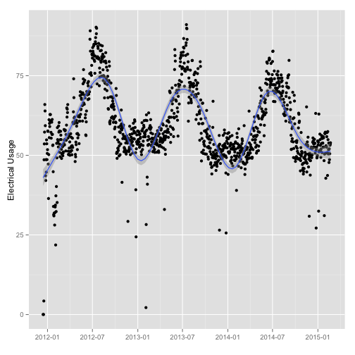

## Why Provide a Cost Estimator

We can estimate electrical costs by examining historical usage data. Provided a month and expected utility costs,
we can provide people estimates on what they can expect for utility costs.

* Provides users an graphical understanding of the electrical usage trends.
* Assists in identifying high or unusual usage patterns where better usage or efficiency can save people money.

The current prototype provides information about Heating and Lighting usage, but can be easily expanded to include additional categories.

--- #page3

## How It Works

<ul>
<li>Preprocess historical data optimized for reporting</li>
<li>Create an interface using the Slidify software package (R language)</li>
<li>Deploy the Slidify application to the server</li>
<li>Users can enter their Utility rates, and select a month</li>
<li>We display a graph of their electricity usage and estimated costs</li>
</ul>

 

--- #page4

## The Working Prototype

<iframe src="https://tobypatterson.shinyapps.io/DataProduct/ " ></iframe>

--- #page5 &radio

## What Did You Learn?

Which month has the highest Lighting Costs ?

1. January
2. April
3. _July_
4. October

*** .hint 

From the Energy Cost Analysis tool, select each month and note the estimated costs returned.

*** .explanation 

The month of July will have an estimated cost of $2061.62 . 
